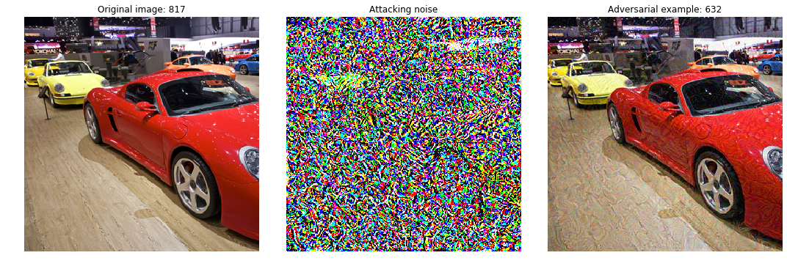
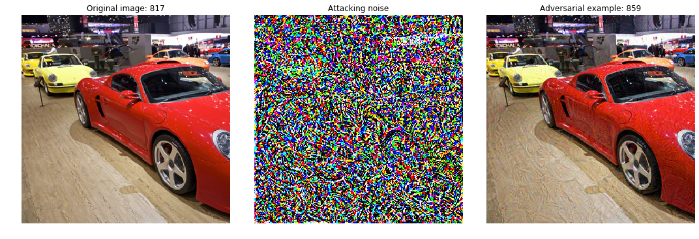

# :trollface: Adversarial Learning

### :pencil2: Blog 

[Mystery of Adversarial Learning]()

---

### 🇰 Kaggle Competition

[Non-targeted challenge](https://www.kaggle.com/c/nips-2017-non-targeted-adversarial-attack/)

[Targeted challenge](https://www.kaggle.com/c/nips-2017-targeted-adversarial-attack)

[Defense challenge](https://www.kaggle.com/c/nips-2017-defense-against-adversarial-attack)

---

### 📚 Library 

[cleverhans](https://github.com/tensorflow/cleverhans/tree/master/cleverhans)

[foolbox](https://github.com/bethgelab/foolbox/tree/master/foolbox)

---

### :postal_horn: Keras

Code Credits: [cleverhans](https://www.kaggle.com/benhamner/adversarial-learning-challenges-getting-started)

Code Credits: [foolbox](https://foolbox.readthedocs.io/en/latest/user/examples.html)

---

### :fire: PyTorch

Code Credits: [cleverhans](https://www.kaggle.com/benhamner/adversarial-learning-challenges-getting-started)

Code Credits: [foolbox](https://foolbox.readthedocs.io/en/latest/user/examples.html)

---

### :fountain: Tensorflow

Code Credits: [cleverhans](https://www.kaggle.com/benhamner/adversarial-learning-challenges-getting-started)

---

### Result

**Non-targeted**

**Targeted**

